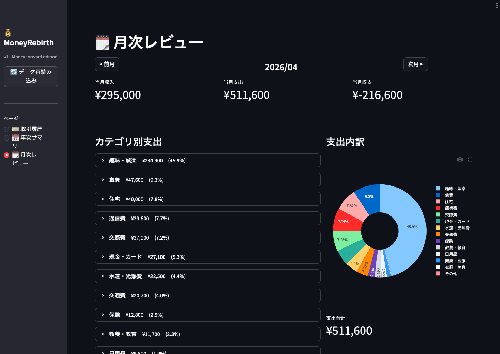
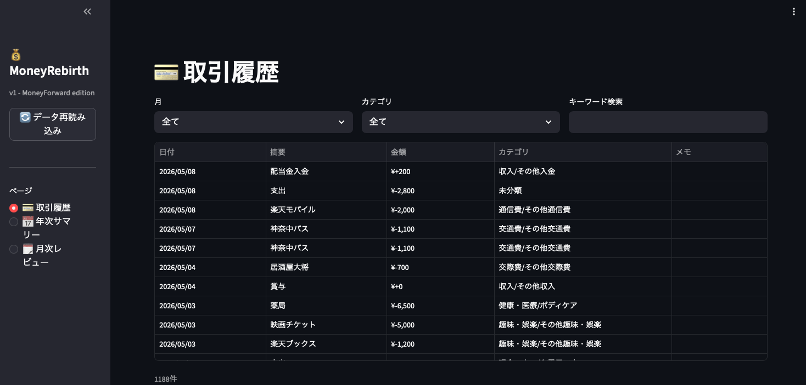

# 💰 MoneyReverse

> Take back control of your financial data.

MoneyForward MEのエクスポートCSVを自前のSQLiteデータベースに取り込み、Streamlitでダッシュボード表示する、完全セルフホスト型の家計簿システムです。

クラウドサービスに依存せず、自分のデータは自分で管理する。それがMoneyReverseのコンセプトです。

---

## 📸 スクリーンショット




---

## ✨ 特徴

- **完全ローカル** — データはすべて自分のマシンに。クラウド不要
- **MoneyForward移行対応** — エクスポートCSVをそのまま取り込み可能
- **重複自動排除** — 同じCSVを何度読み込んでも安全
- **Raspberry Pi対応** — 低消費電力で常時稼働
- **シンプル** — Pythonだけで完結

---

## 🖥️ ダッシュボード（v1）

| ページ | 内容 |
|--------|------|
| 💳 取引履歴 | 月・カテゴリ・キーワードで絞り込み |
| 📅 年次サマリー | 年別支出推移・カテゴリ別グラフ |
| 🗓️ 月次レビュー | カテゴリ別支出内訳・円グラフ |

---

## 🚀 セットアップ

### 必要環境

- Python 3.10+
- pip

### インストール

```bash
git clone https://github.com/moneyrebirth/moneyreverse.git
cd moneyreverse
pip install -r requirements.txt
```

### サンプルデータで試す

```bash
# サンプルCSVを逆向きにデータベースに取り込む 
bash moneyreverse_importfiles.sh

# ダッシュボード起動 
streamlit run moneyreverse_dashboard.py
```

ブラウザで `http://localhost:8501` を開く。

---

## 📥 MoneyForwardのCSVを取り込む

### MoneyForwardからエクスポート

```
MoneyForward ME にログイン
→ 家計簿
→ 収支内訳
→ 画面右上「CSVダウンロード」
→ 期間を選択してダウンロード
```

### 取り込み

```bash
# 1ファイル
python3 moneyreverse_importer.py 収入・支出詳細_2026-04-01_2026-04-30.csv

python3 moneyreverse_importer.py sample_2026_02.csv

# csv/ ディレクトリのファイルを一括取り込み
bash moneyreverse_importfiles.sh
```

重複は自動でスキップされるので、同じファイルを何度実行しても安全です。

---

## 📁 ファイル構成

```
moneyreverse/
├── moneyreverse_dashboard.py    # Streamlitダッシュボード
├── moneyreverse_seomporter.py     # MoneyForward CSVインポーター
├── moneyreverse_im_importfiles.sh  # 一括取り込みスクリプト
├── csv/                         # 取り込むCSV (例: '収入・支出詳細_2026-04-01_2026-04-30.csv') を置くディレクトリ
│   ├── sample_2026-02.csv       # サンプルデータ
│   ├── sample_2026-03.csv
│   └── sample_2026-04.csv
├── docs/
│   ├── demo_monthly_review.png
│   └── demo_transactions.png
├── requirements.txt
├── .gitignore
└── README.md
```

---

## 🔒 プライバシー

- `household.db` はローカルのみ（`.gitignore` で除外済み）
- 個人のCSVファイルも `.gitignore` で除外済み
- `csv/sample_*.csv` のサンプルデータのみGit管理

---

## 🗺️ ロードマップ

- [x] MoneyForward CSVインポート
- [x] 取引履歴・年次サマリー・月次レビュー
- [ ] **v2 (MoneyReBirth) **: 銀行・証券・クレジットカード・Suica対応
- [ ] **v2 (MoneyReBirth) **: カテゴリ自動分類（AI活用）
- [ ] **v2 (MoneyReBirth) **: 資産推移・ポートフォリオグラフ

---

## 🤝 コントリビューション

- バグ報告・機能要望は [Issues](https://github.com/moneyrebirth/moneyreverse/issues) へ
- MoneyForwardのCSVフォーマットが変わった場合もIssueで教えてください

---

## 📄 ライセンス

MIT License

---

*Built with Claude — because your financial data should be yours.*
